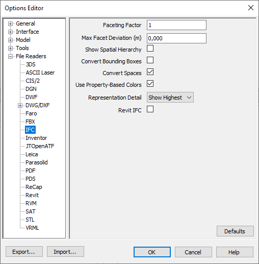

# Working with rooms in an ifc from Archicad in Navisworks

Some tips for working with rooms in Navisworks from an Archicad IFC. Useful for checking the model for FM use cases, as rooms (in Archicad terminology zones) are one of the most important elements in FM.

## Archicad side

The default exporter exports rooms as geometry, so on the Archicad side no special setting required.

I recommend in IFC translators ➡ Data Conversion ➡ Select Derived Data to Export ➡

## Navisworks side

Use this file reader settings in Navisworks to import an ifc exported from archicad:

